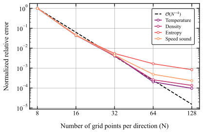
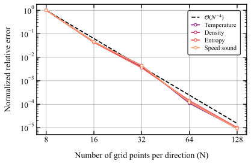

## Bicubic interpolation and grid convergence study

### 1. Bicubic interpolation overview

Bicubic interpolation is a high-order interpolation method used to approximate a smooth scalar field based on tabulated values and derivatives at the nodes of a rectangular grid.
Given function values and partial derivatives at the four corners of each grid cell, bicubic interpolation constructs a **bivariate cubic polynomial** of the form

$$
f(x,y) \approx \sum_{i=0}^3 \sum_{j=0}^3 a_{ij} (x - x_0)^i (y - y_0)^j,
$$

where the coefficients $a_{ij}$ are determined from:

* function values $f$,
* first derivatives $\partial f/\partial x$ and $\partial f/\partial y$,
* and the mixed derivative $\partial^2 f/\partial x \partial y$,

at the four corner points of each cell.
This yields a total of **16 constraints**, exactly matching the number of coefficients in the bicubic polynomial. Once the coefficients are determined for each cell, the interpolant is $C^1$-continuous across cell boundaries, ensuring smooth interpolated fields with **fourth-order convergence order** for smooth functions.

### 2. Grid sensitivity study

In this example, bicubic interpolation is used to tabulate thermodynamic properties of CO₂ as a function of **specific enthalpy** and **pressure**. The property values and their derivatives with respect to enthalpy and log-pressure are computed at discrete grid nodes using finite differences.

To verify the accuracy and convergence behavior of the bicubic interpolation tables, a **grid refinement study** is performed:

* Uniform grids in $h$–$\log(p)$ space are generated with increasing resolutions points in each direction.
* At each resolution, a bicubic table is generated and then evaluated on a **fixed set of validation points**. This avoids evaluating exactly at tabulation nodes.
* The interpolated values are compared against the exact reference values from CoolProp.
* For each property, the **absolute and relative two-norm errors** are computed across all validation points:

$$
||e||_2^{\text{abs}} = \frac{1}{\sqrt{N_{\text{test}}}}
|| f_{\text{interp}} - f_{\text{ref}} ||_2,
\qquad
||e||_2^{\text{rel}} = \frac{1}{\sqrt{N_{\text{test}}}}
\left|\left| \frac{f_{\text{interp}} - f_{\text{ref}}}{f_{\text{ref}}} \right|\right|_2.
$$

The errors are normalized with respect to the coarsest grid to highlight the **convergence trend** as the number of grid points increases.

<figure>
  

    
    
  

  <figcaption align="center"><b>Figure:</b> Grid convergence using forward finite differences (left) and central finite differences (right).</figcaption>
</figure>

### 3. Expected convergence order

For smooth functions and **exact derivatives**, bicubic interpolation achieves **fourth-order accuracy** with respect to the grid spacing:

$$
||e|| \sim \mathcal{O}(h^4),
\quad
\text{equivalently } ||e|| \sim \mathcal{O}(N^{-4}) \quad \text{since } h \propto 1/N.
$$

A reference line proportional to $N^{-4}$ is included in the log-log convergence plot to illustrate this theoretical rate.

### 4. Effect of gradient accuracy

The accuracy of the derivatives tabulated at the grid nodes is critical to achieve the expected interpolation order:

* **Forward finite differences** are **first-order accurate**, meaning that the derivative error scales as $\mathcal{O}(h)$. When these inaccurate derivatives are used in the bicubic coefficient calculation, the overall interpolation convergence rate is **slower than fourth order** for sufficiently fine grids. This results in a visible degradation of convergence at high resolutions: the error no longer decreases with the expected quartic slope.

* **Central finite differences** are **second-order accurate**, giving gradient errors that scale as $\mathcal{O}(h^2)$. These are sufficiently accurate to preserve the underlying fourth-order convergence of bicubic interpolation. Consequently, when central differences are used, the error curves on the grid refinement plot closely follow the theoretical $\mathcal{O}(N^{-4})$ line.

This behavior clearly illustrates that the **gradient approximation scheme is the limiting factor**: even if the interpolation algorithm is formally fourth order, inaccurate gradient estimates can reduce the overall convergence rate to that of the gradient computation.

### 5. Practical trade-off

* Using **forward finite differences** allows for faster table generation since it requires 4 function evaluations per point. This is advantageous for rapid preprocessing or when moderate accuracy is sufficient.
* Using **central finite differences** involves extra evaluations (9 per point) but significantly improves gradient accuracy and allows the **full theoretical interpolation order** to be achieved. For production-quality tables or applications requiring high accuracy, this is the preferred approach.
