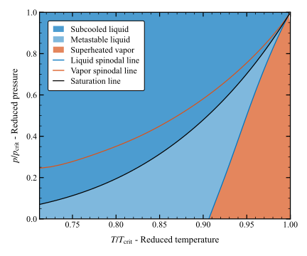
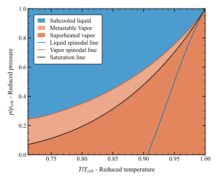
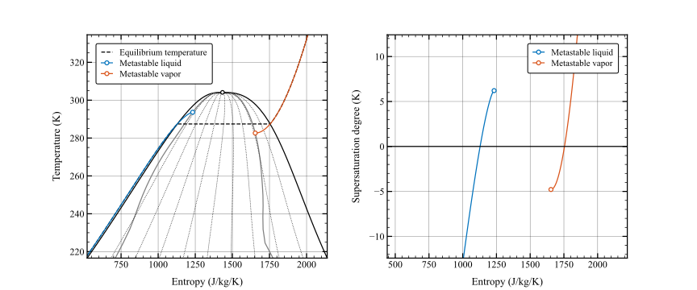
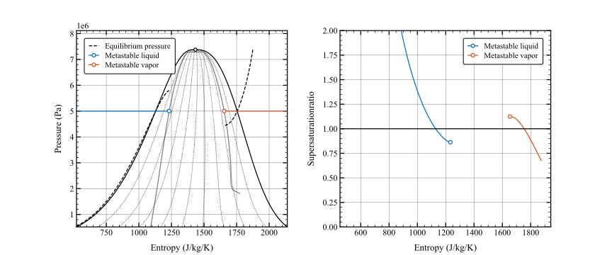
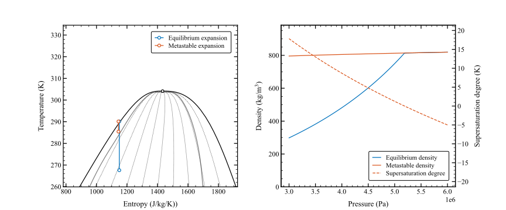
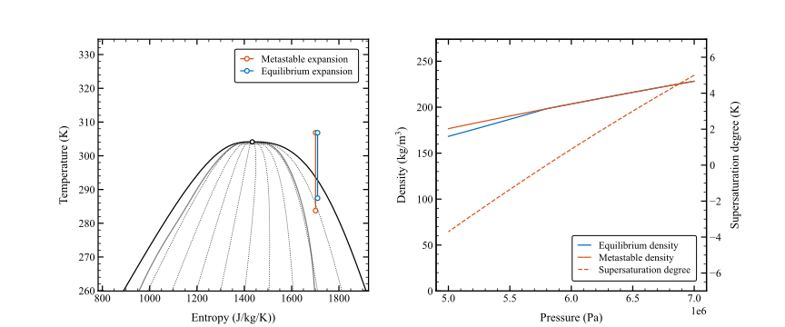

## Supersaturation definition

The supersaturation degree is defined as the actual temperature minus the saturation temperature at the corresponding pressure:

$$ \Delta T = T - T_\text{sat}(p)$$

The supersaturation ratio is defined as the actual pressure divided by the saturation pressure at the corresponding temperature:

$$ S = \frac{p}{p_\text{sat}(T)} $$

The metastable liquid and metastable regions are illustrated below in the pressure-temperature diagram.
In the metastable liquid region $\Delta T > 0$ and $S<1$, meaning that the liquid temperature is higher equilibrium temperature and will tend to evaporate. Conversely, in the metastable vapor region $\Delta T < 0$ and $S>1$, meaning that the liquid temperature is lower than the equilibrium temperature and will tend to condense.

    

        
        
Metastable liquid region

    

    

        
        
Metastable vapor region

    

## Isobaric processes

Non-equilibrium phase change and metastable thermodynamic states for an isobaric heating (or cooling) process are illustrated in the figure below. The process is representative of heat addition in an evaporator (or heat rejection in a condenser):

### Metastable liquid:
When subooled liquid is heated at constant pressure its temperature increases until it reaches the saturation temperature. According to thermodynamic equilibrium, the temperature then remain constant as the liquid evaporates. However, in reality, the liquid temperature may increase beyond the saturation temperature, leading to metastable states with a positive supersaturation degree (corresponding to a supersaturation ratio lower than unity). The metastable effects are only physically possible between the saturation and spinodal lines. However, in reality, the fluid remains as a liquid only over a narrow supersaturation range, and once a critical supersaturation is reached, the phase change process is triggered and takes place rapidly until the liquid-gas mixture reaches thermodynamic equilibrium.

### Metastable vapor:
When a superheated vapor is cooled at constant pressure its temperature decreases until it reaches the saturation temperature. According to thermodynamic equilibrium, the temperature then remains constant as the vapor condenses. However, in reality, the vapor temperature may decrease beyond the the saturation temperature, leading to metastable states with a negative supersaturation degree (corresponding to a supersaturation ratio greater than unity). The metastable effects are only physically possible between the saturation and spinodal lines. However, in reality, the fluid remains as a vapor only over a narrow supersaturation range, and once a critical supersaturation is reached (Wilson line), the phase change process is triggered and takes place rapidly until the liquid-gas mixture reaches thermodynamic equilibrium.

 

    
    
Isobaric heating of liquid and cooling of vapor

    
    
Isobaric heating of liquid and cooling of vapor

## Isentropic processes

Non-equilibrium phase change and metastable thermodynamic states for isentropic expansion processes in the liquid and vapor regions process are illustrated below. These processes are representative of the expansion of a liquid or vapor in a nozzle or in a turbine.

#### Liquid expansion

As the liquid expands and enters the two-phase region it may remain as a metastable liquid until it reaches a certain degree of positive supersaturation. When the phase change starts, saturated vapor at a saturation temperature lower than the liquid temperature is formed. The formation of this vapor requires the liquid to provide the enthalpy of vaporization, which reduces the temperature of the metastable liquid. The phase transition process continues until the liquid-vapor mixture reaches the equilibrium temperature and the supersaturation degree is equal to zero.
- The equilibrium state has significantly lower density than the metastable liquid.
- The equilibrium state has lower temperature (positive degree of supersaturation, saturation ratio less than one).
- Positive degree of supersaturation means that the liquid is too hot and will tend to evaporate (the temperature decreases to the saturation temperature as the phase change takes place).
- The liquid has to provide the enthalpy of vaporization for the formation of the vapor phase.

    
    
Isentropic expansion of subcooled liquid

#### Vapor expansion

As the vapor expands and enters the two-phase region it may remain as a metastable vapor until it reaches a certain degree of positive supersaturation. When the phase change starts, saturated liquid at a saturation temperature higher than the vapor temperature is formed. The condensation of this liquid requires the vapor to absorb the enthalpy of vaporization, which increases the temperature of the metastable vapor. The phase transition process continues until the liquid-vapor mixture reaches the equilibrium temperature and the supersaturation degree is equal to zero.
- The equilibrium state has slightly lower density than the metastable liquid.  This, perhaps counter-intuitive, behavior is explained by the fact that the metastable vapor reaches a lower temperature for the same exit pressure.
- The equilibrium state has higher temperature (negative degree of supersaturation, saturation ratio more than one).
- Negative degree of supersaturation means that the vapor is too cold and will tend to condense (the temperature increases to the saturation temperature as the phase change takes place).
- The vapor has to absorb the enthalpy of condensation for the formation of the liquid phase.

    
    
Isentropic expansion of superheated vapor 

